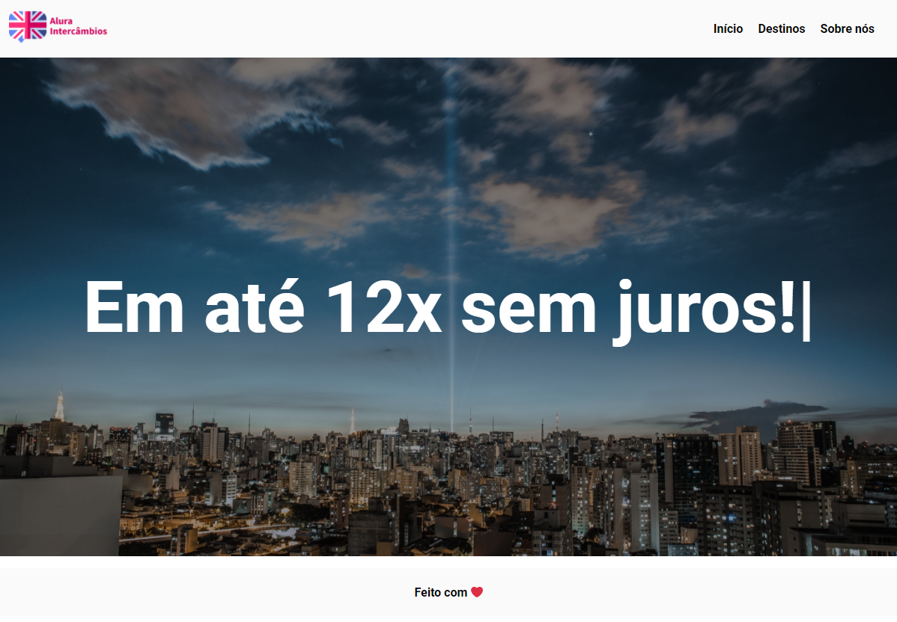

# Curso de Wordpress - Alura

## :mortar_board: Conteúdo do curso
- tenda como funciona a hierarquia de arquivos do WordPress
- Veja como buscar conteúdo de páginas e posts
- Saiba como criar posts customizados
- Aprenda a criar campos customizados nos posts
- Entenda como montar um tema no WordPress

#### :pushpin: Conteúdo Detalhado
**Criando um tema**
- Instalando o WordPress
- Configurando um novo tema
- Header e Footer

**Configurando o cabeçalho**
- Menu de navegação
- Adicionando logo
- Arquivos de estilos

**Hierarquia dos templates**
- Loop WordPress
- Estilos Sobre Nós
- Rodapé

**Posts customizados**
- Posts customizados
- Taxonomia
- WP_Query e estilos

**Customizando consulta**
- Formulário
- Filtrando países
- Ajustando filtro

**Metabox**
- Página home
- Configurando metabox
- Salvando dados metabox
- Trazendo imagem banner

**Texto dinâmico**
- Adicionando scripts
- Texto dinâmico

## :hammer: Instalação
1 - Instale o Wordpress no seu servidor

2 - Instale e ative esse tema no seu Wordpress 
